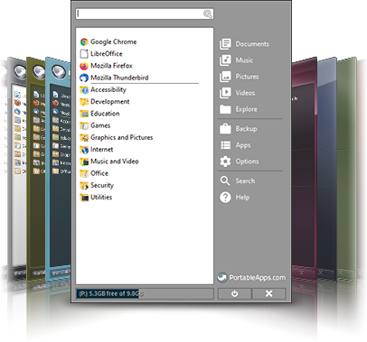
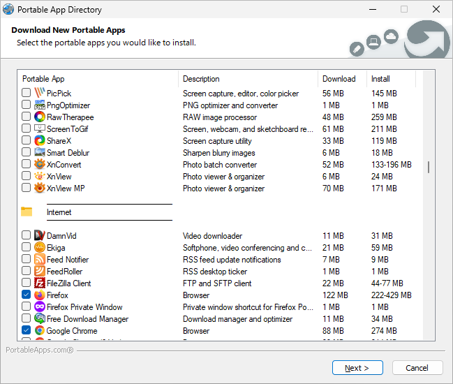
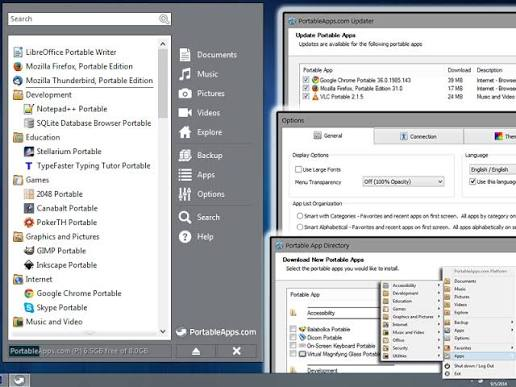

# PortableApps Platform

PortableApps Platform is a free open-source menu for a portable software suite. You keep apps, settings, and documents on a USB drive, an external SSD, a synced cloud folder, or a local disk. The host PC does not get a normal install.

PortableApps Platform Launcher starts each app from that folder. portableapps com platform is the same product line: menu, store, updater, and installer. portableapps platform for windows is the usual host. portableapps platform usb is the usual carry case.

## Description

PortableApps Platform ties portable apps into one menu. You build a custom suite and take it to work, home, or a lab PC. Browser bookmarks, office files, and editor settings stay next to the apps.

The menu searches by name, groups by folder or favorite, and applies a theme. Automatic updates keep the suite current. Integrated backup copies personal files and app data with the suite.

You can live in the catalog or pin a local folder as if it were a catalog app. Language variants switch in a few clicks on multi-language titles. A failed primary mirror falls back to the next host.

PortableApps Platform Launcher is the start stub for an app in PortableApps format. It handles working directories, INI moves, and a clean exit so the host stays tidy.

Menu host code in this pack is [Program.cs](platform/Program.cs). Launcher start is launcher/Program.cs next to [Settings.cs](launcher/Settings.cs). Tile UI is [Control.cs](launcher/Control.cs).

## About

portableapps com platform is the management system. You browse a large freeware and open-source catalog, install with one click, and run from the menu. LibreOffice, GIMP, and Firefox are typical catalog rows.

Each portable app can use PortableApps Platform Launcher so a USB letter change does not break paths. A wrapper next to the app keeps data in the suite folder.

App rows in the catalog sample are [app_database.json](app_database.json). Install flow is [InstallOrchestrator.cs](services/InstallOrchestrator.cs). Deploy steps sit in AppDeployService.cs under services/.

## Preview

Official pages show the menu, the store list, type-to-find, and a themed icon grid. This pack uses FOTO placeholders instead of those remote stills.

Expect a category list, a search box, favorites, and an updater badge when a catalog app has a new build.

## Features

PortableApps Platform and PortableApps Platform Launcher cover the jobs on the vendor feature page.

- Built-in app store: browse and install hundreds of freeware and open-source programs
- Automatic updates for the suite and for each portable app
- USB, external SSD, cloud folder, or local disk
- Backup of personal files, settings, and documents
- Folders, favorites, type-to-find, themes
- portableapps platform for windows, including Windows 11
- Language packs on multi-language apps
- Mirror fallback when a download host fails
- One click install or update; setup can run in the background
- Updates shown, not forced
- Reinstall or uninstall a managed app
- Backup and restore app data across uninstall
- Disk use per app, sortable
- Light and dark theme
- List or tile view
- Filter by name, version, date, size
- Keyboard search in the menu

PortableApps Platform Launcher extras for an app in format:

- INI and directory moves
- Registry isolation when the format asks for it
- Command line pass-through
- Custom code only when a simple INI is not enough
- Works from a command line or Send To
- Language switch when the Platform locale changes
- Proven installer core bundled inside the launcher

Store and safety extras on portableapps com platform:

- Curated notices before a risky catalog install
- Hash check after download
- Per-app CLI arguments
- Files dropped on the Platform exe can go to the selected app

Registry helpers in this pack are key.go under win/. Environment helpers are env.go in the same folder. File copy helpers are file.go. Shortcut create is create.go.

Updater code is [SelfUpdater.cs](services/SelfUpdater.cs). Backup is [AppBackupService.cs](services/AppBackupService.cs). Main menu chrome is [MainWindow.axaml.cs](ui/MainWindow.axaml.cs). List state is [MainViewModel.cs](ui/MainViewModel.cs).

| Piece | Role |
| --- | --- |
| PortableApps Platform | Menu, store, updater, backup |
| PortableApps Platform Launcher | Starts one portable app |
| portableapps com platform installer | Packs a PAF tree |
| portableapps com platform updater | Refreshes catalog apps |

## Advantages

- One folder is the whole suite
- Works from USB, SSD, cloud, or a local path
- Easy to copy and back up
- Host install stays empty
- Same menu on every PC you plug into
- Search and categories beat a raw folder of exes
- Updates and backup live in the same product
- portableapps platform usb survives a drive letter change when the launcher is used

Suite options sit in [settings.ini](settings.ini). Launcher layout sample is [launcher.xml](launcher/launcher.xml).

## Requirements

### Windows

portableapps platform for windows: Windows 10 or later is the current target. Older Platform builds still mention XP through 8. x64 is the usual installer. No extra runtime beyond what the catalog app itself needs.

Windows 11 uses the same menu. After a feature update, open the Platform once so the updater can refresh.

### Linux

The vendor line is Windows first. Some portable apps run under WINE. That is not a second Platform. Keep the suite on an NTFS or exFAT USB if you also plug it into Windows.

## System Requirement

- Microsoft Windows for the menu and PortableApps Platform Launcher
- Writable suite folder (USB, SSD, cloud sync, or local)
- Disk space for the catalog apps you add
- Network only when you use the store or updater

A locked Program Files copy cannot save menu layout or backups. Prefer a user folder or a removable drive.

Cloud sync (Drive, Dropbox, and similar) works when the suite folder stays in one synced path. Do not run the updater on two PCs against the same cloud folder at the same time.

An external SSD is fine. Treat it like portableapps platform usb: eject after the menu closes.

## Running

After setup, start the Platform exe from the suite root. The menu lists installed portable apps. Type to find. Click to launch. PortableApps Platform Launcher is what actually starts the app folder.

Startup scripts can run when the suite opens. A sample is [Startup.cmd](startup/Startup.cmd). Disk attach helpers in this pack live in [Diskpart.cs](platform/Diskpart.cs) if you keep the suite on a virtual disk file.

Do not paste a machine-local loop address into a shared menu command. Use a relative path inside the suite.

Close apps from the menu before you eject portableapps platform usb. The updater should be idle. A cloud folder should finish sync before you shut the PC.

If the menu is empty, you pointed setup at a folder that is not the suite root. Run the Platform exe from the folder that contains the PortableApps directory.

Worker and service types for the host sit in platform/Worker.cs and platform/Service.cs. Startup host is startup/Program.cs. Inventory host is inventory/Program.cs.

## Example Workspace

A ready USB or folder tree looks like this:

| Path | What it holds |
| --- | --- |
| Platform exe | PortableApps Platform menu |
| PortableApps\ | Installed portable apps |
| Documents\ | Personal files the backup can include |
| Data\ | Menu layout, themes, updater state |

Put Firefox Portable, LibreOffice Portable, and a text editor in PortableApps\. Favorites pin the daily three. Folders group the rest. portableapps platform usb then feels like a small Start menu you own.

Tile drawing in this pack is MetaTile.cs under launcher/. Inventory scan samples are Scanner.cs and Storage.cs under inventory/.

## Changes

Platform and launcher builds move often. Read the vendor news before you skip an updater run. A withdrawn build happens; wait for the next numbered setup.

Typical notes: menu search fixes, updater mirror fallback, launcher INI moves, Windows 11 taskbar and scaling, backup of Data\.

Do not mix a new PortableApps Platform Launcher with an ancient app format folder. Let the updater rewrite that app, or reinstall it from the store.

A Platform setup named 30.x is still this product. The latest paf from the official page replaces the older exe in place. Keep Documents\ and Data\ when you upgrade.

Invalid paths in a settings section should be ignored, not crash the menu. Environment names are case-sensitive on some helpers. Custom scaling on a high-DPI laptop can shift tiles; open settings and reset the grid if icons overlap.

Build.xml and build.yaml in FILES are pack build notes, not the vendor setup. go.mod, util.go, logger.go, and dialog.go are pack libraries. App.axaml.cs is the UI bootstrap. The csproj in FILES is a pack project file.

## Links

Vendor pages worth opening: download, apps catalog, platform features, about. This pack keeps sample files next to the README, not a second site.

Catalog JSON is app_database.json. Security notice sample is security_notices.json under services/. Windows setup helper is [windows-install.bat](windows-install.bat).

## Contributing

Complaints count. So do format files and launcher INI fixes.

File an issue with the app name, the Platform version, and whether the suite sat on USB, cloud, or a local disk. A screenshot of the menu helps more than a path dump alone.

Code changes in this pack land under launcher/, platform/, services/, and ui/. Config helpers include [config.go](config.go). Process start helpers are [exec.go](win/exec.go).

Push a fork. Open a pull request. Write what changed.

## License Terms

PortableApps Platform is open source under the vendor EULA and GPL notes on the site. This pack keeps one LICENSE file at FILES root for bundled sources. Do not add a second LICENSE beside README.

PortableApps Platform Launcher follows the same open-source line for free and freeware apps. Commercial packaging needs a vendor OK.

## Contact

Vendor forums and the portableapps.com site are the support path. Email in INFO.txt is a pack stub unless the vendor published another address.

Issues about a missing catalog row belong on the app page, not as a Platform crash.

News and locale pages (ja, fr, and others) are on the same site. They are not a second product. The English download is enough for portableapps platform for windows.

Facebook and video links on the vendor site are optional. They are not required to run the menu.

## Download

Use the GET badge for this pack. Vendor setup is the portableapps com platform installer from the official download page. That exe is portableapps platform exe in search results.

Pick portableapps platform for windows. Install to a USB, an SSD, a cloud folder, or a local path. Then open the store and add apps. PortableApps Platform Launcher is included when an app is in format; you do not download it separately for daily use.

After install, open the menu, install two catalog apps, and click each once. A row that fails only on a locked USB is a write-permission issue, not a bad setup.

Keep the suite folder writable. A protected copy cannot save favorites or backups.

Stable is the current vendor setup. Older paf names in search (30.0.4, 30.1.3, 29.5.3) are past Platform builds. Use the GET badge or the official download page, not a random mirror.

codecov.yml and FakePortableAppsPlatform.nsi in FILES are pack extras. The nsi file is an installer stub sample, not a second menu.

If the GET badge is all you need, stop there. If you compare USB vs cloud, start on a stick, then copy the whole suite folder to the synced path once the menu looks right.

Do not install two Platform copies that point at the same PortableApps folder. One menu, one suite. A second copy fights the first for updater locks.

Uninstall is "remove the suite folder" after you copy Documents\ out. There is no system uninstall key you must hunt for when you used a portable setup.

SettingsService.cs under services/ stores menu options. AppInfo.cs under ui/ is one catalog row. App.axaml.cs boots the window host.

If search finds nothing, clear the category filter. A hidden folder of apps still sits on disk; the menu only shows what the store or a manual add registered.

A second Windows user on the same PC needs its own suite folder. Do not share one Data\ tree across accounts.

## Related Questions

**Can you install apps on a USB?**

Yes. That is the main job of PortableApps Platform. Install the Platform to the USB, then install catalog apps into the suite. portableapps platform usb keeps apps and data on the stick. Eject after you close the menu.

**What are the top 10 most useful apps?**

On this Platform the useful set is the ones you open every day. A common first ten from the store: a browser, LibreOffice, a PDF reader, GIMP or a paint app, 7-Zip, a text editor, VLC, an antivirus scanner, a password manager, and a notes app. Add them from the built-in store. Your ten will differ.

**What is an app platform?**

Here it is the menu and managers around portable apps: store, updater, backup, search, themes. PortableApps Platform is that layer. PortableApps Platform Launcher is the per-app start stub, not the whole platform.

**What are portable apps?**

Apps that run from a folder without a normal install. Settings stay in that folder. You copy the folder to another PC and keep working. windows portableapps on this product means those apps plus the Platform menu.

## Related Search Terms

PortableApps Platform, PortableApps Platform Launcher, portableapps com platform, portableapps platform for windows, portableapps platform usb, portable, windows, launcher, platform, usb, applauncher, appmanager, windows-11, portable-exe, portableapps
